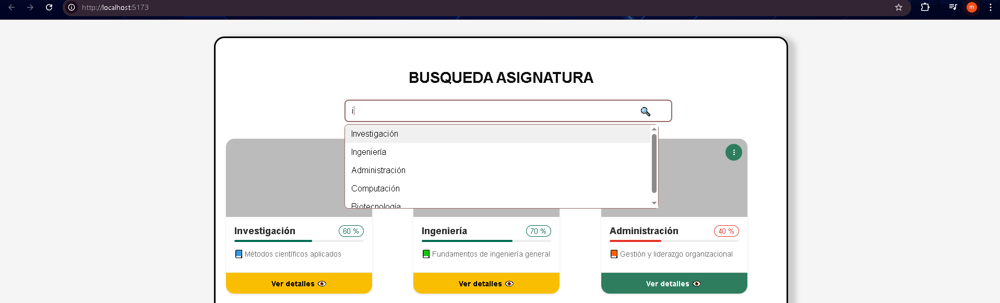
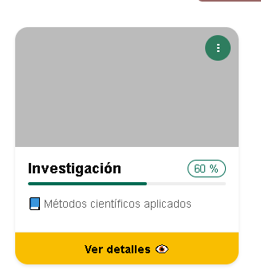
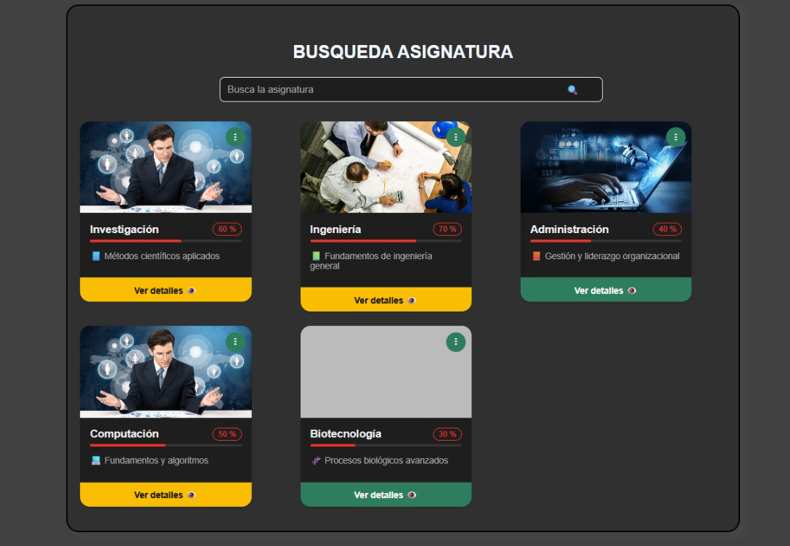
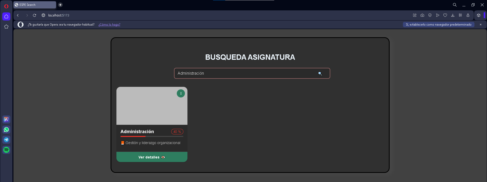
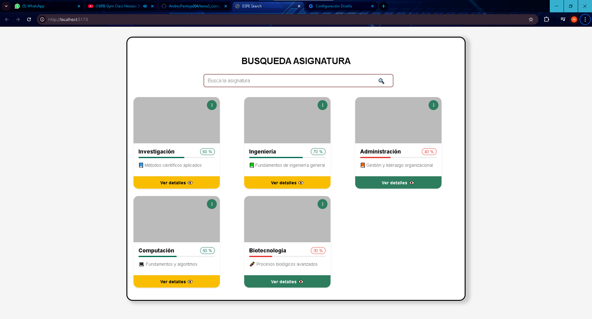
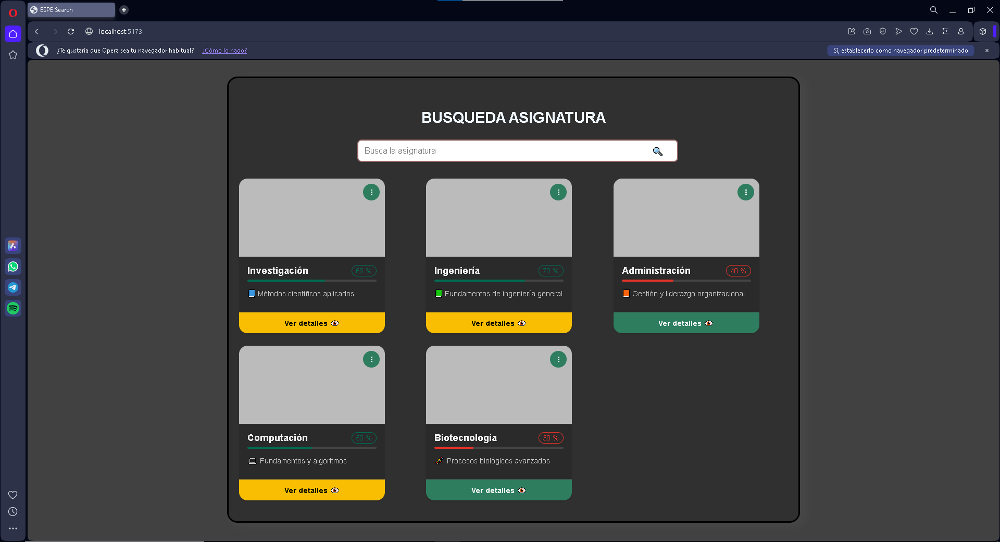
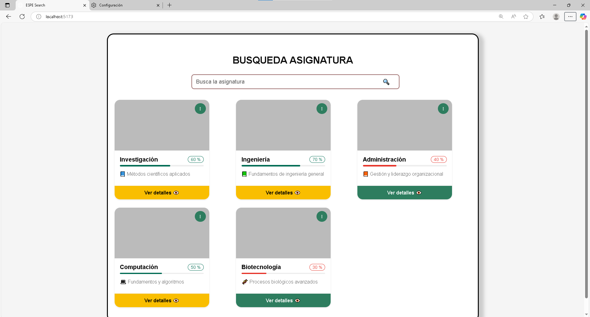

# Doumentacion de Tarea 3 Grupo 1
## Componente ESPE Search
ESPE Search es una interfaz web basada en Lit que permite buscar asignaturas mediante un campo de entrada con sugerencias dinámicas, y visualizar tarjetas informativas con el progreso y detalles de cada asignatura. Este proyecto combina dos componentes personalizados (`<espe-search-input>` y `<espe-course-card>`) y se adapta a la identidad visual de la ESPE.
## Funcionalidades de los componentes
### 1. Componente `<espe-search-input>`
Un campo de búsqueda interactivo con sugerencias automáticas y eventos personalizados.

Propiedades:
- sugerencia-seleccionada: Se dispara al hacer clic en una sugerencia.
- buscar-enter: Se dispara al presionar Enter.

Comportamiento:
- Filtra las sugerencias dinámicamente.
- Soporta selección con clic o teclado.
- Muestra sugerencias debajo del input.

### Ejemplo visual: Sugerencias desplegadas
Al escribir en el campo de búsqueda, se muestran automáticamente sugerencias relacionadas.



### 2. Componente `<espe-course-card>`
Una tarjeta visual para mostrar información de la asignatura buscada (también se muestra en la interfaz gráfica principal)
Composición:
- Imagen (placeholder).
- Título y descripción.
- Barra de progreso animada.
- Botón interactivo.

### Ejemplo visual: Card Asignatura
Aqui podemos ver como se ve nuestra tarjeta visualmente



### 🖼️ Soporte de imagen en `<espe-course-card>`

El componente ahora admite un nuevo atributo llamado `imageUrl`, que permite mostrar una imagen personalizada asociada a cada asignatura.  
Esta imagen se carga en la parte superior de la tarjeta, mejorando la identidad visual de cada curso.

#### 🔧 Atributo `imageUrl`

| Atributo   | Tipo     | Descripción                                                              |
|------------|----------|---------------------------------------------------------------------------|
| `imageUrl` | `string` | URL de la imagen que se mostrará en la parte superior de la tarjeta del curso. |

### Ejemplo visual: Imagen personalizada en la tarjeta
Cada tarjeta puede mostrar una imagen representativa del curso en la parte superior.



## ¿Cómo interáctuan o cuál es su lógica general en la interfaz?
El sistema está diseñado para facilitar la búsqueda visual e interactiva de asignaturas. El mismo combina un componente de entrada `<espe-search-input>` que gestiona la búsqueda del usuario con un conjunto de tarjetas de asignatura `<espe-course-card>` que se filtran en tiempo real según la entrada del usuario.

### Función Inicial: Carga del componente

El componente <espe-search-input> recibe un arreglo de sugerencias (asignaturas disponibles) mediante la propiedad suggestions. Cada `<espe-course-card>` representa una asignatura y tiene un atributo data-nombre de la cual permite identificarla dentro del input para fines de búsqueda.


### Evento del componente: Filtrado dinámico

El usuario comienza a escribir, el componente `<espe-search-input>` actualiza automáticamente la lista de sugerencias visibles, filtrando aquellas que coinciden parcial o totalmente con el nombre a buscar. Al presionar una sugerencia o la tecla Enter, el componente emite un evento personalizado (sugerencia-seleccionada o buscar-enter).

### Resultado: Respuesta al evento

- La lógica de filtrado está implementada en un <script> externo, que escucha los eventos disparados por `<espe-search-input>`.
- Al capturar el evento, se obtiene el valor seleccionado o ingresado y se compara con los atributos data-nombre de cada tarjeta de curso.
- Las tarjetas cuyo data-nombre incluye el texto buscado se mantienen visibles (style.display = 'block'), mientras que las que no coinciden se ocultan (style.display = 'none').

### Ejemplo visual: Resultado del filtrado
Solo se muestran las tarjetas que coinciden con el texto buscado.



### Interacción visual

El componente muestra una animación de carga si el usuario presiona Enter (loading = true) para simular una búsqueda más realista. Luego de 1 segundo, se oculta automáticamente (loading = false). Las tarjetas se mantienen estilizadas con indicadores visuales como colores en la barra de progreso (progressColor) y botones personalizables (buttonTheme).

### Ejemplo HTML de los componentes
Atributos del componente `<espe-search-input>`
| Atributo      | Tipo       | Descripción                                      |
| ------------- | ---------- | ------------------------------------------------ |
| `theme`       | `string`   | Define el color del borde del campo de entrada.  |
| `placeholder` | `string`   | Texto guía dentro del campo de búsqueda.         |
| `suggestions` | `string[]` | Lista de valores sugeridos mientras se escribe.  |
| `loading`     | `boolean`  | Muestra un ícono de carga cuando está en `true`. |
| `disabled`    | `boolean`  | Desactiva el campo de entrada si es `true`.      |
```html
<!-- Componente de búsqueda -->
<espe-search-input
  theme="#986665"
  placeholder="Busca la asignatura"
  .suggestions=${["Investigación", "Ingeniería", "Administración", "Computación", "Biotecnología"]}
></espe-search-input>
```

Atributos del Componente `<espe-course-card>`
| Atributo        | Tipo                     | Descripción                                              |
| --------------- | ------------------------ | -------------------------------------------------------- |
| `title`         | `string`                 | Título del curso o asignatura.                           |
| `description`   | `string`                 | Breve descripción del contenido del curso.               |
| `progress`      | `number`                 | Porcentaje de progreso del curso.                        |
| `progressColor` | `'green'` \| `'red'`     | Color visual de la barra y la insignia de progreso.      |
| `buttonTheme`   | `'green'` \| `'yellow'`  | Tema visual del botón "Ver detalles".                    |
| `data-nombre`   | `string` (atributo HTML) | Usado para comparar en búsquedas y filtrado de tarjetas. |
```html
<!-- Tarjetas de asignaturas -->
<espe-course-card
  data-nombre="Computación"
  title="Computación"
  description="💻 Fundamentos y algoritmos"
  progress="50"
  progressColor="green"
  buttonTheme="yellow"
></espe-course-card>
```
## Ejemplo de uso en diferentes navegadores

En esta sección se muestra cómo se visualiza el componente en diferentes navegadores.  
El modo claro u oscuro se aplica automáticamente según la preferencia de tema del sistema operativo o navegador del usuario.  
Por ello, el componente puede mostrarse en modo claro o en modo oscuro dependiendo del entorno en el que se visualice.

### Navegador 1 Google Chrome
En el primer navegador que se utilizo fue Google Chrome el cual se puede ver que el sistema 
tiene tema claro por ende sale en blanco el componente


### Navegador 2 Opera
En el segundo navegador que se utilizo fue Opera el cual se puede ver que el sistema 
tiene tema oscuro por ende sale en blanco el componente


### Navegador 3 Microsoft Edge
En el tercer navegador que se utilizo fue Microsoft Edge el cual se puede ver que el sistema 
tiene tema claro por ende sale en blanco el componente

