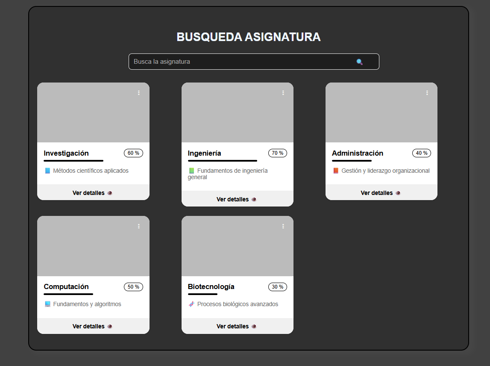

# 📚 Componente Web: `<espe-course-card>`

Este componente Lit personalizado muestra una tarjeta informativa para asignaturas, cursos o módulos. Incluye un título, descripción, barra de progreso, botón de acción y estilos personalizables.

---

## 📸 Vista previa

### 🟢 Componente aún sin estilos personalizados



---

## 🚀 Instalación

1. Instalar dependencias [`npm i  | npm install`]
2. Asegúrate de tener un proyecto con soporte para módulos ES (`type="module"`).
3. Importa el componente:

```html
<script type="module" src="src/espe-course-card.ts"></script>
